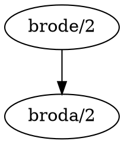
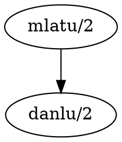
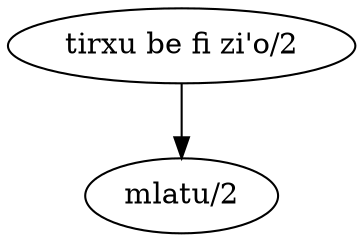

# 2: Posetal logic

We now focus on relations which have posetal inner structure.

Suppose, for some two ``{broda}`` and ``{brode}``,

    ro da ro de zo'u:

    da broda de
    ----------- (rule)
    da brode de

By some rule. The quantifiers need to be ``{ro}``, but they can be
typed/restricted with ``{poi}``. Then, there is an inner implication, which I'm
calling the posetal implication, from ``{broda}`` to ``{brode}``. These
implications are called "posetal" because they are structured like posets
([WP](https://en.wikipedia.org/wiki/Partially_ordered_set),
[nLab](https://ncatlab.org/nlab/show/partial+order)):

* Chained implications are like transitivity
* Equivalences are like antisymmetry
* Conjunction and disjunction work like in posets
* The top and bottom relations are the trivially true and false relations

This structure, interacting with the normal relational logic, is what produces
our categorical allegory structure.

Now, without further ado, let's introduce a two-dimensional rule for this
inner logic. We recall ``{kairni'i}`` from set theory; the posetal logic is
exactly the logic of the lattice of relations that we introduced earlier.
Here, rather than using the lattice properties to build functional
properties, we'll focus on the poset properties.

    ro da ro de zo'u:  ||
                       ||
    da broda de        || pa ka ce'u broda ce'u kei kairni'i pa ka ce'u brode ce'u (rule is posetal)
    ----------- (rule) ||
    da brode de        ||

On the left, standard one-dimensional rules of the sort we've been working
with let us proceed in standard deductive style. On the right, we have axioms
which let us start proofs with posetal facts.

We can remove typed restrictions from the LHS's prenex as long as they're
removed from both the top and bottom.

## Notation: Posets

Throughout the rest of the book, we will use graphical syntax for posetal
relations. When we write a diagram like:



We mean that {brode} and {broda} are both binary relations which are related by
{kairni'i}:


    ro da ro de zo'u:

    da brode de
    ----------- (brode => broda)
    da broda de

## Families

Many selbri naturally exhibit posetal structure, particularly the saske valsi,
which have a dedicated upcoming chapter. The structures are useful for
classification, comparison, and theorizing. A posetal family is a collection of
(at least two) selbri which are connected by posetal structure.

A good example of a posetal family would be ``{danlu}`` and its subrelations.
Each member of the family gives a rule like:

    ro da ro de zo'u:

    da mlatu de
    ----------- (mlatu => danlu)
    da danlu de



I give the [entire family of
animals](https://github.com/MostAwesomeDude/zaha/tree/master/jbobau/danlu) in
the appendix; here is a small slice:

```dot process
{{#include ../../mlatu.dot}}
```

## Notation: Restricted Arity

A student of the baseline will notice that {tirxu} is defined with three
places. By "tirxu/2" we mean that the third and following places are filled
with {zi'o}, as previously discussed. We could more explicitly write:



This is often useful in smoothing out the baseline gismu. If places need to be
permuted first, then an explicit {se} conversion will be given.

## Functional Properties

Recall the four functional properties of univalence, totality, injectiveness,
and surjectiveness, as well as bijections, which are both injective and
surjective. Now, let's try to find these properties within the baseline!

The family of animal selbri mentioned above all follow the basic pattern of
being surjective functions from danlu1 to danlu2.
